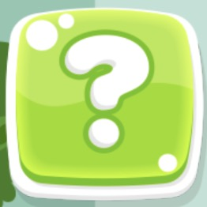
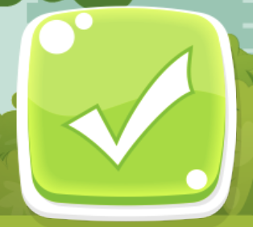

# DECO7381-UnityProject-Waste_Sorting_Game

Desgined by Zhi Zeng, Zhenyu Zhu, Yuanchao Jiang, Peiwen Li & Muhammad Fathriza Zakeeffa
 
Designers Info：
Zhenyu Zhu - 45633472
Muhammad Fathriza Zakeeffa - 46224242
Zeng Zhi - 46024406
Peiwen Li - 45619319
Yuanchao Jiang - 46094025

# Introduction to the game

With the purpose of increasing children’s knowledge of waste sorting, the design opportunity is to design a game application for the children under 9 and their family.

# Walkthrough the game

Firstly, you need to open the game through “waste sorting game.exe”. When you are on the homepage, you can click the button with question mark to watch the tutorial of the game. During the tutorial, you can click the “homepage” button to return back or you can click the button on the right to enter the next step. By the way the loop button is used for changing the color of trash bin. After this tutorial you will have a general understanding of the game and know which bin is used for what kind of garbage. Next, you can click the “play” button to enter the game mode. First, you need to choose the level and some levels are locked (you need to finish the previous levels to unlock them). In the game you need to catch the garbage using different kind of trash bin. When the time is finished you need to answer the questions in the popup. That's all of the game.

# Installation

The file will contain two files, one is built for windows and the other one is built for macOS. For demostration poporse, just select which ever one that fit the user's system. Download the zip file from github, extract the zip file, and you will see the 2 builds. Just double click the one that fits your computer system and open it, then just enjoy.

# Usage
Children under 9 years old will play this game to increase their knowledge of waste sorting.

# Game Play Instruction

Home page:

 

When you start the game, the first page (home page) you will see.

Buttons on Home page:

 

  
   
  
 

These pictures indicate the basic function of how to play the game. 

When you click on the play button, In the selection page, you need to choose the level of the game, some of the levels are locked and you need to pass the previous levels to unlock them.

 

When you click on the tutorial button, it enters the tutorial page as shown below:

 

In each level you have two minutes to play it. What you need to do is to catch the correct garbage with the accurate trash bin. If time is up, you need to answer the questions in the popup and get extra score.

  
   
  
 

Then when you fail to catch the garbage and loss all your lifes, or the time ended, you will recieve the marks and game over page.

 

With the newly build-in pop up quiz system, the users could gain marks easily:

 

